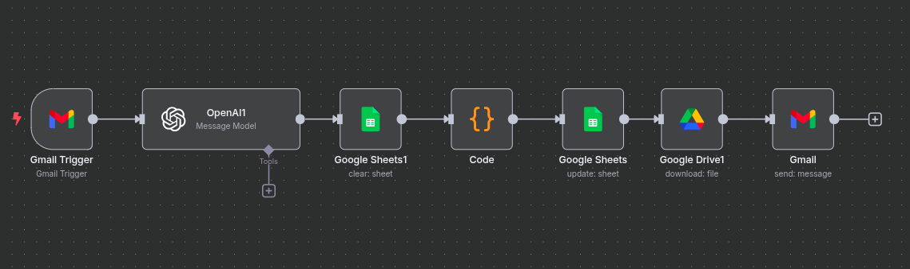
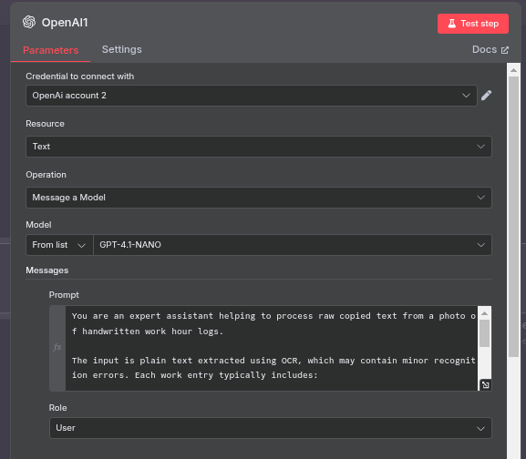

# Invoice Updater and Auto-Responder (n8n)

The purpose of this self-hosted [n8n](https://n8n.io) workflow is to automate the process of invoice creation and PDF formatting.
In simple terms, this workflow use the Gmail API to check for new emails, the OpenAI API to extract and process hand-written work log entries, Google Sheets API to update an invoice template with formatted invoice data, Google Drive to create and download a PDF report, and lastly, it sends the final invoice PDF to the a specific recipient.

## Services Employed

- [OpenAI API](https://platform.openai.com/)
- [Google Cloud Gmail API](https://console.cloud.google.com/)
- [Google Sheets API](https://developers.google.com/sheets)
- [Google Drive API](https://developers.google.com/drive)

## How It Operates

1. When a new email that meets your criteria arrives, the **Gmail Trigger** is activated.
2. **OpenAI Node**: Transforms email content into structured JSON invoice entries by sending it to GPT-4.1-NANO with a predefined [configuration prompt](config_prompt).

3. **Code Node**: Parses text string from the ChatGPT node to JSON format.
4. **Clear + Update in Google Sheets**: Clears out an invoice template in Google Drive before updating it with new parsed data entries.
5. **Google Drive (Download)**: Gets a Google Sheet formatted to PDF sent to the the recipient that meeets your criteria.

## Set up Required Credentials

- OpenAI API Key
- Google Sheets, Drive, and Gmail (OAuth2 or App Passwords)

## Replace the following in the workflow:

- Google Sheet ID (in Sheets node)
- Gmail “To” and “From” fields (in Send and trigger nodes)

## Notes
- This workflow runs fully on a self-hosted n8n instance.
- You can hoste this automation on the cloud for free. I used this tutorial: [Setting up a free n8n server on Oracle Cloud](https://www.thomasmartens.eu/setting-up-a-free-n8n-server-on-oracle-cloud/)  
